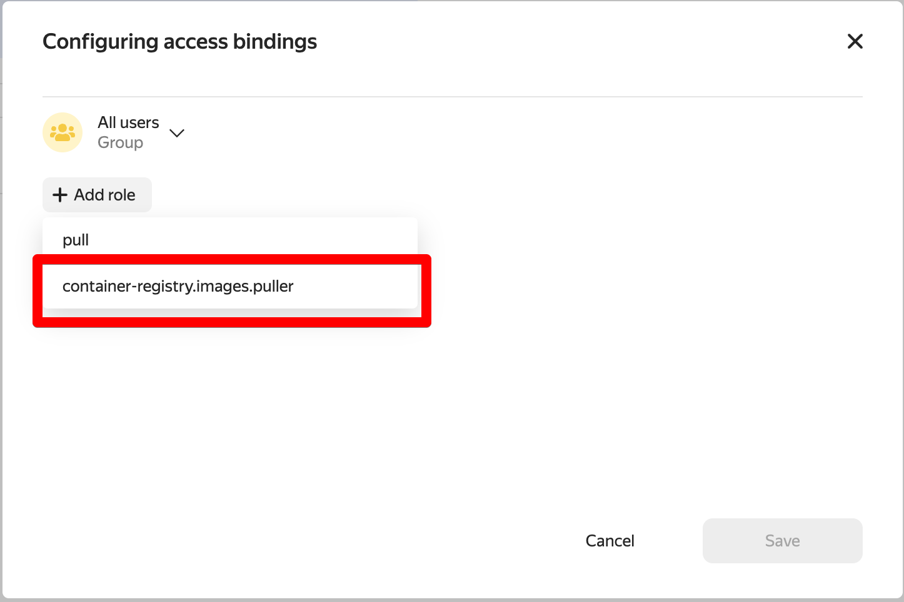

# Helm-чарт для установки приложения в Kubernetes

После успешной аутентификации в кластере склонируйте репозиторий этого чарта к себе на компьютер.

В файле `app/values.yaml` измените значения переменных. Укажите ссылку на реджистри, созданного в Yandex Cloud и версию образа:

```yaml
image:
  repository: "адрес образа в формате cr.yandex/<registry id>/<repo name>"
  pullPolicy: IfNotPresent
  # Overrides the image tag whose default is the chart appVersion.
  tag: "версия образа в реджистри"
```

Установите Helm-чарт:

```shell
helm upgrade --install --atomic test app
```
Успешно запускается командой без флага `--atomic`. С ним - падает.
```bash
helm upgrade stg-service app -n c08-timur-alejnikov
```

## Настройка реджистри Yandex Cloud

Для разрешения возможности пуллинга образов из вашего реджисти, настройте политику доступа. Нужно выдать роль `container-registry.images.puller` на ваш реестр для системной группы allUsers.

В настройках реджистри нажмите "Назначить роли" в правом верхнем углу и выберите группу "All Users":


Назначте этой группе роль `container-registry.images.puller`:



## Сборка stg-service

```bash
docker build . -t cr.yandex/crp61lj4oj01botu0ub0/stg_service:v2023-04-24-r1
docker push cr.yandex/crp61lj4oj01botu0ub0/stg_service:v2023-04-24-r1
# вносети правку в /service_stg/app/values.yaml в tag: "v2023-04-24-r1"
helm upgrade stg-service app -n c08-timur-alejnikov
```
